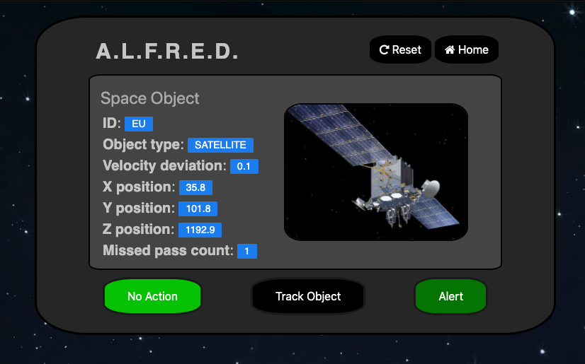

# A.L.F.R.E.D.
ALFRED is a domain-agnostic machine learning tool for recommending user actions based on previous behaviour. While ALFRED can add value to any environment where human operators perform repetitive actions in response to data streams, this demo is focused on the use case for Space Situational Awareness (SSA) operators.

SSA involves receiving data about orbital objects from a network of sensors and taking actions to avoid conjunctions (collisions) or gather more information. In this use case, ALFRED would be deployed locally for each operator. A domain-specific preprocessing module would process the operator's raw data stream into lower dimensional states representing information the operator tends to act on. The operator would then work as normal on his own software while also logging his actions with the touch of a button on ALFRED's UI. Over time, ALFRED will learn the operator's behaviour and the recommended actions (highlighted in green) will become more and more accurate. Initially this will provide the operator with accurate visual action recommendations, but in the long term ALFRED can potentially integrate with domain-specific software to fully automate aspects of the operator's job, increasing operational capacity and allowing operators to devote more time to more complex tasks.

##Components
ALFRED has three components:
* Simple, user-friendly UI
* Data log
* Machine learning system

These components are designed to be flexible and largely domain-agnostic; in principle they should handle and display arbitrary input states and action choices.

This demo is built using flask with a vanilla CSS/HTML/JS frontend. The recommender system (`core/recommender.py`) uses the Gaussian Naive Bayes and Decision Tree classifiers from sklearn. While earlier versions of this demo implemented an SQL database for action logging, this feature was taken out to keep things simple as data logging is not the focus of this demo. Instead, data is kept in python objects which are serialized using flask-session.

##How to run
1) clone this repo `git clone https://github.com/benibienz/ALFRED.git`
1) cd into ALFRED directory: `cd ALFRED`
1) (optional) create virtual env: `python3 -m venv env`
1) (optional) activate venv: `source env/bin/activate`
1) install requirements: `pip install -r requirements.txt`
1) run: `python main.py`
1) (run as background process): `nohup python main.py &`
1) view the app on a browser: http://0.0.0.0:8080/
1) Ctrl + C to stop